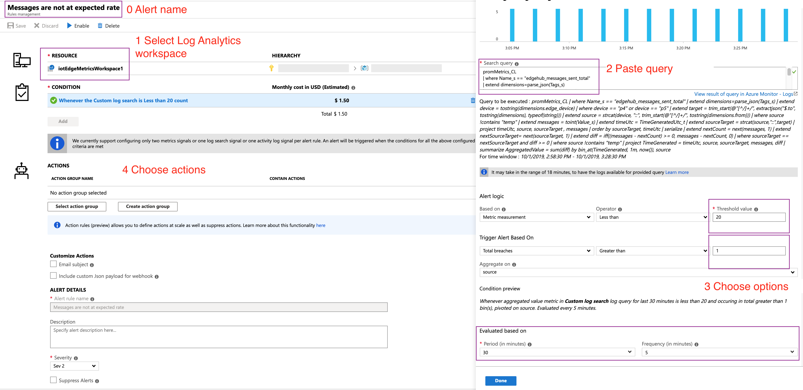

# Azure IoT Edge Hub experimental metrics

## Architecture


## Setup

1. [Create](https://docs.microsoft.com/en-us/azure/azure-monitor/learn/quick-create-workspace#create-a-workspace) an Azure Log Analytics workspace and note its [workspace ID and key](https://docs.microsoft.com/en-us/azure/azure-monitor/platform/agent-windows#obtain-workspace-id-and-key).

1. Use IoT Edge Hub with tag `1.0.9-rc2` and following configuration: 

    ```json

    # Linux settings

    "edgeHub": {
        "settings": {
            "image": "mcr.microsoft.com/azureiotedge-hub:1.0.9-rc2",
            "createOptions": "{\"ExposedPorts\":{\"9600/tcp\":{},\"5671/tcp\":{},\"8883/tcp\":{}}}"
        },
        "type": "docker",
        "env": {
            "experimentalfeatures__enabled": {
                "value": true
            },
            "experimentalfeatures__enableMetrics": {
                "value": true
            }
        },
        "status": "running",
        "restartPolicy": "always"
    }

    # Windows settings (requires running as 'ContainerAdministrator' for now)

    "edgeHub": {
        "settings": {
            "image": "mcr.microsoft.com/azureiotedge-hub:1.0.9-rc2",
            "createOptions": "{\"User\":\"ContainerAdministrator\",\"ExposedPorts\":{\"9600/tcp\":{},\"5671/tcp\":{},\"8883/tcp\":{}}}"
        },
        "type": "docker",
        "env": {
            "experimentalfeatures__enabled": {
                "value": true
            },
            "experimentalfeatures__enableMetrics": {
                "value": true
            }
        },
        "status": "running",
        "restartPolicy": "always"
    }

    ```


1. Add the *metricscollector* module to the deployment:

    | Linux amd64 image                    | Windows amd64 image                          |
    |--------------------------------------|----------------------------------------------|
    | `veyalla/metricscollector:0.0.4-amd64` | `veyalla/metricscollector:0.0.5-windows-amd64` |

    **Desired properties for *metricscollector***

    | Name                  | Description                                                                                                                                                                            | Type         |
    |-----------------------|----------------------------------------------------------------------------------------------------------------------------------------------------------------------------------------|--------------|
    | `schemaVersion`       | Set to "1.0"                                                                                                                                                                           | string       |
    | `scrapeFrequencySecs` | Metrics collection period in seconds. Increase or decrease this number depending on how often you want to collect metrics data.                                                      | int          |
    | `metricsFormat`       | Set to "Json" or "Prometheus".   Note, the metrics endpoints are expected to be in  Prometheus format. If set to "Json", the metrics are converted JSON format in the collector module | string       |
    | `syncTarget`          | Set to "AzureLogAnalytics" or "IoTHub"  When set to "AzureLogAnalytics", environment variables  `AzMonWorkspaceId` and `AzMonWorkspaceKey` need to be set                              | string       |
    | `endpoints`           | A JSON section containing name and collection URL key-value pairs.                                                                                                                     | JSON section |
    >Sometimes you might see a timeout error in *metricscollector* during the first collection, subsequent collection attempts (after configurated collection period) should succeed. This is because IoT Edge doesn't provide module start order guarantees and it might start this module before edgeHub's metrics endpoint is ready.

    **Sending metrics to Azure Monitor directly**

    Set the following environment variables for this module:

    | Name                | Value                     |
    |---------------------|---------------------------|
    | `AzMonWorkspaceId`  | Workspace ID from Step 1  |
    | `AzMonWorkspaceKey` | Workspace key from Step 1 |

    Desired properties for the module:

    ```json
    {
        "properties.desired": {
            "schemaVersion": "1.0",
            "scrapeFrequencySecs": 300,
            "metricsFormat": "Json",
            "syncTarget": "AzureLogAnalytics",
            "endpoints": {
                "edgeHub": "http://edgeHub:9600/metrics"
            }
        }
    }
    ```

    **Sending metrics to Azure Monitor via IoT Hub**

    As shown in the architecture diagram it is also possible to send data to Azure Monitor via IoT Hub. This pattern is useful in scenarios where the edge device cannot communicate to any other external endpoint other than IoT Hub. Store and forward (leveraging the IoT Edge Hub) of metrics data when the device is offline is another useful property of this pattern.

    However, this requires some cloud infra setup for routing *metricsCollector* messages to a different Event Hub which are then picked up by a Azure Function and sent to an Azure Monitor workspace.

    I've found [Pulumi](https://www.pulumi.com/docs/get-started/azure/install-pulumi/), an infrastructure-as-code tool, to be an easy and pleasant way of setting this up. The [routeViaIoTHub folder](./routeViaIoTHub) contains the code I used. If you already have existing resources, you can use Pulumi to [import](https://www.pulumi.com/blog/adopting-existing-cloud-resources-into-pulumi/) them or if don't want to use Pulumi, you can take the Azure Function logic and deploy it via your preferred method.

    This pattern doesn't require any Azure Monitor credentials on the device side. Simply use `IoTHub` as the `syncTarget` like so:

    ```json
    {
        "properties.desired": {
            "schemaVersion": "1.0",
            "scrapeFrequencySecs": 300,
            "metricsFormat": "Json",
            "syncTarget": "IoTHub",
            "endpoints": {
                "edgeHub": "http://edgeHub:9600/metrics"
            }
        }
    }
    ```

## Visualize

Deploy the Azure Monitor Workbook template by following the instructions from [here](azmon-workbook-template/).

Here is a screenshot of the visualization that Workbook provides:


## Configure Alerts

[Log-based alerts](https://docs.microsoft.com/azure/azure-monitor/platform/alerts-log) can be configured for generating alerts on unexpected conditions. 



### Query for alert when messages are not at expected rate

```
promMetrics_CL
| where Name_s == "edgehub_messages_sent_total"
| extend dimensions=parse_json(Tags_s)
| extend device = tostring(dimensions.edge_device)
| extend target = trim_start(@"[^/]+/", extractjson("$.to", tostring(dimensions), typeof(string)))
| extend source = strcat(device, "::", trim_start(@"[^/]+/", tostring(dimensions.from)))
| extend messages = toint(Value_s)
| extend timeUtc = TimeGeneratedUtc_t
| extend sourceTarget = strcat(source,"::",target)
| project  timeUtc, source, sourceTarget , messages
| order by sourceTarget, timeUtc
| serialize
| extend nextCount = next(messages, 1)
| extend nextSourceTarget= next(sourceTarget, 1)
| extend diff = iff((messages - nextCount) >= 0, messages - nextCount, 0)
| where sourceTarget  == nextSourceTarget and diff >= 0
| project  TimeGenerated = timeUtc, source, sourceTarget, messages, diff
| summarize AggregatedValue = sum(diff) by  bin(TimeGenerated, 1m), source
```
The query can be modified to filter to specific devices or modules.

### Query for alert when messages received not same as messages sent upstream

*Assumes all received messages are sent upstream.*

```
let set1 = promMetrics_CL
| where Name_s == "edgehub_messages_sent_total"
| extend dimensions=parse_json(Tags_s)
| extend device = tostring(dimensions.edge_device)
| extend target = trim_start(@"[^/]+/", extractjson("$.to", tostring(dimensions), typeof(string)))
| extend source = strcat(device, "::", trim_start(@"[^/]+/", tostring(dimensions.from)))
| extend messages = toint(Value_s)
| extend timeUtc = TimeGeneratedUtc_t
| extend sourceTarget = strcat(source,"::",target)
| where sourceTarget contains "upstream"
| order by sourceTarget, timeUtc
| serialize
| extend nextCount = next(messages, 1)
| extend nextSourceTarget= next(sourceTarget, 1)
| extend diff = iff((messages - nextCount) >= 0, messages - nextCount, 0)
| where sourceTarget == nextSourceTarget and diff >= 0
| project  timeUtc, source, sourceTarget, diff
| summarize maxMsg=sum(diff), lastestTime=max(timeUtc) by source
| project lastestTime, source, maxMsg;
let set2 = promMetrics_CL
| where Name_s == "edgehub_messages_received_total"
| extend dimensions=parse_json(Tags_s)
| extend device = tostring(dimensions.edge_device)
| extend source = strcat(device, "::", trim_start(@"[^/]+/", tostring(dimensions.id)))
| extend messages = toint(Value_s)
| extend timeUtc = TimeGeneratedUtc_t
| order by source, timeUtc
| serialize
| extend nextCount = next(messages, 1)
| extend nextSource= next(source, 1)
| extend diff = iff((messages - nextCount) >= 0, messages - nextCount, 0)
| where source == nextSource and diff >= 0
| project  timeUtc, source, diff
| summarize maxMsgRcvd=sum(diff), lastestTime=max(timeUtc) by source
| project lastestTime, source, maxMsgRcvd;
set1
| join set2 on source
| extend delta=maxMsgRcvd-maxMsg
| project TimeGenerated=lastestTime, source, maxMsg, maxMsgRcvd, delta
| summarize AggregatedValue = max(delta) by bin_at(TimeGenerated, 30m, (now() - 5m)), source
```


